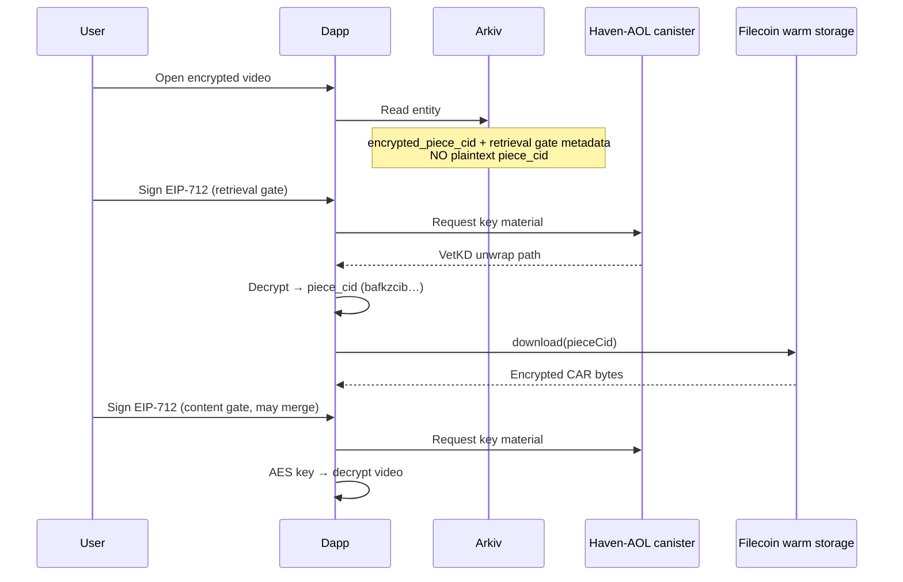

# Encrypted `piece_cid` on Arkiv

**Date:** 2026-05-17  
**Status:** Planned (not implemented)  
**Repos:** `haven-cli`, `haven-dapp`  
**Prerequisite context:** Synapse-only retrieval (`piece_cid` → `fetchPieceFromSynapse`); gateway / `useOptimalVideoSource` removed.

---

## Problem statement

| Layer | Property | Implication |
|--------|-----------|-------------|
| **Arkiv** | Durable, public entity catalog (“phone book”) | Anything in clear text is visible forever to indexers and readers |
| **Filecoin Pin / Synapse** | Censorable warm storage (“warehouse”) | Blockers target **piece CID** (`bafkzcib…`) or SP/Synapse paths |
| **Content** | AES + Haven-AOL gate | Watching still requires wallet + ICP; does not hide **where** bytes live |

Today:

- **`encrypted_cid`** (attribute): encrypts the **IPFS root** `bafy…` — root hidden on Arkiv.
- **`piece_cid`** (payload): **plaintext** — warehouse address is in the phone book.

An adversary who can read Arkiv does not need to break content encryption to know **which Filecoin piece to block**. That defeats the goal of using Arkiv as uncensorable metadata while keeping storage censorable.

**Design rule:** The warehouse address (`piece_cid`) must not appear in clear text on Arkiv.

---

## Goals

1. **Storage-target privacy on Arkiv** — Readers without gate access cannot learn `piece_cid`.
2. **Keep Synapse-only byte retrieval** — After gate, download only via `synapse.storage.download({ pieceCid })`.
3. **No legacy dual routing** — No IPFS gateway fallback, no “decrypt root then fetch.”
4. **Single gate UX where possible** — Minimize extra wallet popups vs today’s one content-key flow.

## Non-goals (this plan)

- Making Filecoin/Synapse uncensorable (impossible).
- Hiding piece CID from network observers after a successful download.
- Re-introducing IPFS HTTP gateway playback.
- Backward compatibility with entities that only have plaintext `piece_cid`.

---

## Target architecture



### Identifier roles (after change)

| Field | Format | On Arkiv | Used for |
|--------|--------|----------|----------|
| `encrypted_piece_cid` | Base64 AES-GCM blob | Payload or attribute | Concealed Synapse address |
| `piece_encryption_metadata` | Haven-AOL gate v1 JSON | Payload | Decrypt piece CID (retrieval gate) |
| `encryption_metadata` | Haven-AOL gate v1 JSON | Payload | Decrypt content AES key (existing) |
| `encrypted_cid` | Base64 (root CID) | Attribute | Optional catalog privacy for `bafy…`; **not** used for fetch |
| `original_hash` | `sha256:…` | Payload | Content gate derivation (existing) |

**Plaintext `piece_cid` must not be written to Arkiv** for new uploads.

---

## Gate design options

### Option A — Separate retrieval gate (recommended for clarity)

- **`piece_encryption_metadata`**: gate v1 with `cid` = piece CID (or deterministic id, see below).
- **`encrypted_piece_cid`**: ciphertext of piece CID string (same pattern as `encrypted_cid` for root).
- **`encryption_metadata`**: unchanged (content key, `cid` = `sha256:{original_hash}`).

**Pros:** Clear separation; retrieval policy can differ from content policy later.  
**Cons:** Potentially **two** EIP-712 signatures per first play (retrieval + content) unless batched in UI.

### Option B — Single gate, dual ciphertext

- One gate metadata object; two encrypted payloads (`encrypted_piece_cid` + content key in existing field).
- Derivation `cid` might be `sha256:{original_hash}` only; piece binding via associated data or second encrypted field.

**Pros:** One wallet flow.  
**Cons:** More complex metadata schema; harder to rotate retrieval vs content policy independently.

### Option C — Encrypt only `piece_cid`; drop `encrypted_cid` on new uploads

- Root `bafy…` not stored on Arkiv at all for encrypted videos (only piece matters for Synapse path).
- **Pros:** Simpler catalog.  
**Cons:** Lose explicit root for restore/IPNI/debug tooling unless kept off-chain.

**Recommendation:** **Option A** for v1 implementation; evaluate merging signatures in the dapp UX layer.

---

## haven-cli changes

### Upload pipeline

1. After `executeUpload`, obtain `pieceCid` (`bafkzcib…`) — already required; keep `require_piece_cid` fail-fast.
2. **Encrypt piece CID** with Haven-AOL (mirror `_encrypt_cid` for root):
   - Gate params from content gate (same `chain`, `tokenAddress`, `threshold`) unless product wants different retrieval ACL.
   - `cid` field for piece gate: use **piece CID string** or `sha256:{piece_cid}` (pick one, document in `ARKIV_FORMAT.md`).
3. Write to context:
   - `encrypted_piece_cid` (base64 ciphertext)
   - `piece_encryption_metadata` (gate v1 JSON)
4. **Stop writing** plaintext `piece_cid` in `_build_payload`.
5. Keep `encryption_metadata`, `encrypted_cid` (root), `original_hash` as today unless Option C adopted.

### Arkiv sync (`arkiv_sync.py`)

```text
# Pseudocode — payload rules
if upload_result.root_cid:
    assert encrypted_piece_cid and piece_encryption_metadata
    payload["encrypted_piece_cid"] = ...
    payload["piece_encryption_metadata"] = gate_metadata_to_json(...)
    # payload MUST NOT contain piece_cid

payload["piece_cid"]  # DELETE for new entities
```

- Fail sync if upload succeeded but piece encryption fields missing (symmetric with today’s `require_piece_cid`).
- Update gold-standard tests; use real `bafkzcib…` fixtures.

### Docs

- `docs/ARKIV_FORMAT.md`: document `encrypted_piece_cid`, `piece_encryption_metadata`; mark plaintext `piece_cid` as **deprecated / never for new uploads**.

---

## haven-dapp changes

### Parse (`parse-arkiv-video.ts`)

- Read `encrypted_piece_cid`, `piece_encryption_metadata`.
- **Do not** populate `video.pieceCid` from Arkiv plaintext (field absent on new entities).
- Optional: `video.encryptedPieceCid` + `video.pieceEncryptionMetadata` on `Video` type.

### Retrieval flow (`useVideoCache`, `useVideoDownload`, `video-prefetch`)

Replace:

```text
requirePieceCid(video) → fetchPinnedContent(video)
```

With:

```text
1. decryptPieceCid(video)   // Haven-AOL, retrieval gate → piece_cid string
2. fetchPieceFromSynapse(piece_cid)
3. decryptContentKey(...)   // existing content gate
4. chunked decrypt / cache    // existing
```

### New / restored hook

- **`usePieceCidDecryption`** or extend a small **`useRetrievalCid`** helper:
  - Input: `pieceEncryptionMetadata`, `encryptedPieceCid`
  - Output: `pieceCid` (validated `bafkzcib…`)
  - Reuse `decryptCidWithHavenAol` (already in `haven-aol-decrypt.ts`).

### UI / loading stages

- Re-add a loading stage between cache check and fetch, e.g. `unlocking-storage` or reuse `authenticating` with distinct copy:
  - “Sign to unlock storage location…”
  - Then “Downloading…”
- Consider **one** wallet modal that signs both gates if haven-aol supports sequential requests without double confusion.

### Caching

- **Do not** persist plaintext `piece_cid` in IndexedDB Arkiv cache long-term unless behind same gate as session (prefer in-memory only for current session after decrypt).
- AES key cache unchanged.

### Errors

- Missing retrieval metadata: “Re-upload with current haven-cli” (same class as missing `piece_cid` today).
- Invalid gate: existing Haven-AOL error mapping.

### Tests

- `download-cid` / new `retrieval-cid` tests: decrypt path returns valid piece CID.
- `ipfsService`: mock decrypt → Synapse.
- No tests expecting plaintext `piece_cid` on mock Arkiv entities.

---

## Security notes (honest bounds)

| Threat | Mitigated? |
|--------|------------|
| Arkiv reader learns piece without gate | **Yes** (if plaintext `piece_cid` removed) |
| Blocker with gate access learns piece | **No** (by design — authorized users need it) |
| Network observer after download | **No** |
| IPNI / public root advertisement off-Arkiv | **Partially** — out of scope unless CLI stops IPNI advertise |
| Censor Arkiv entity / app / ICP | **No** — different layer |

Encrypting `piece_cid` shifts censorship effort from “read Arkiv → block piece” to “break gate or block infrastructure.”

---

## Migration

**No backward compatibility** (aligned with current product direction).

| Entity type | Behavior |
|-------------|----------|
| Old: plaintext `piece_cid` only | **Unsupported** — show re-upload message (same as today for missing piece) |
| Old: no `piece_cid` | Re-upload |
| New: `encrypted_piece_cid` + gate | Supported |

Optional later: one-release read fallback (plaintext `piece_cid` if present) — **explicitly out of scope** unless product requests it.

---

## Implementation phases

### Phase 1 — CLI + schema

- [ ] Encrypt piece CID at upload; Arkiv payload fields
- [ ] Remove plaintext `piece_cid` from payload
- [ ] `require_piece_cid` + `require_piece_encryption_fields` on sync
- [ ] `ARKIV_FORMAT.md` + CLI tests

### Phase 2 — Dapp retrieval

- [ ] Types + parse Arkiv
- [ ] `decryptPieceCid` before Synapse in cache / download / prefetch
- [ ] Loading UX + errors
- [ ] Unit tests (100% on new modules)

### Phase 3 — UX polish

- [ ] Combine wallet prompts where possible
- [ ] Session-only piece CID memory (no durable plaintext in IDB)
- [ ] Library/sync: no assumption that `pieceCid` exists on `Video` from Arkiv

### Phase 4 — Verification

- [ ] End-to-end: upload → Arkiv entity has no plaintext piece → play in dapp
- [ ] Confirm entity JSON from explorer shows no `piece_cid`
- [ ] Re-upload guidance for legacy entities

---

## Open decisions (resolve before coding)

1. **Same gate vs separate gate** for retrieval and content (Option A vs B).
2. **Piece gate `cid` field** — literal `bafkzcib…` vs `sha256:{piece_cid}` vs bind to `original_hash`.
3. **Keep `encrypted_cid` (root)** on new uploads or drop (Option C).
4. **Attribute vs payload** for `encrypted_piece_cid` (payload preferred; matches other secrets).
5. **Prefetch** — skip until retrieval gate satisfied (no wallet popup on hover without key cache).

---

## Related files (current baseline)

| Area | Path |
|------|------|
| Piece validation (CLI) | `haven-cli/haven_cli/services/piece_cid.py` |
| Arkiv payload | `haven-cli/haven_cli/services/arkiv_sync.py` |
| Root CID encrypt | `haven-cli/haven_cli/pipeline/steps/upload_step.py` (`_encrypt_cid`) |
| Synapse upload | `haven-cli/js-services/synapse-wrapper.ts` |
| Dapp fetch | `haven-dapp/src/services/ipfsService.ts` |
| Dapp piece require | `haven-dapp/src/lib/download-cid.ts` |
| Dapp play | `haven-dapp/src/hooks/useVideoCache.ts` |
| CID decrypt primitive | `haven-dapp/src/lib/haven-aol/haven-aol-decrypt.ts` (`decryptCidWithHavenAol`) |

---

## Success criteria

1. New Arkiv entity JSON contains **`encrypted_piece_cid`** + **`piece_encryption_metadata`**, and **no** `"piece_cid": "bafkzcib…"`**.
2. Dapp plays encrypted video only after retrieval gate + content gate.
3. Unauthenticated Arkiv scrape cannot extract Synapse piece CID.
4. All new code paths covered by unit tests; no gateway / dual-route regression.
