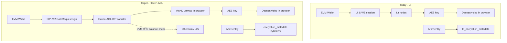

# Lit → Haven-AOL Migration Plan (haven-dapp)

**Status:** Implemented (Phase 1-3, 5 complete; Phase 4 pending soak)  
**Last updated:** 2026-05-16  
**Scope:** haven-dapp (read/playback). Upload path is haven-cli (already on Haven-AOL).

## Goal

Keep **haven-dapp as an Ethereum-first application** (wagmi/Reown, Arkiv on EVM, wallet identity on EVM) while replacing **Lit Protocol** with **Haven-AOL** for decryption. ICP is a **narrow dependency**: VetKD key release via the Haven-AOL canister—not user identity, not storage, not wallet plumbing.

Reference repos in this workspace:

- `haven-aol-main/` — TypeScript decrypt SDK, derivation spec, mainnet canister docs
- `haven-cli-main/` — Upload/encrypt pipeline, Arkiv entity shape, EIP-712 signing (Python)
- web3-shoutbox-platform-main/ - web3 reference frontend
---

## Current vs target architecture



| Layer | Stays on Ethereum / existing stack | New ICP touchpoint |
|--------|-----------------------------------|---------------------|
| Auth UX | Wallet connect, `signTypedData` (EIP-712) | None (anonymous `HttpAgent`) |
| Access policy | Token/NFT balance on EVM chains | Canister calls EVM RPC |
| Metadata index | Arkiv | Unchanged |
| Content storage | IPFS/Filecoin | Unchanged |
| Symmetric crypto | AES-256-GCM (`src/lib/crypto.ts`) | Unchanged |
| Key wrapping | Lit BLS-IBE | VetKD + IBE (`haven-aol`) |

---

## What haven-cli already does

The upload path is **already Haven-AOL** (`haven_cli/crypto/haven_aol_local.py`, `encrypt_step.py`). Arkiv payloads use gold-standard field names documented in `haven-cli/docs/INTEGRATION_GUIDE.md`:

- `encryption_metadata` (JSON) — hybrid AES fields + Lit-shaped `accessControlConditions`
- `cid_encryption_metadata` (optional) — same shape for encrypted root CID
- `encrypted_cid` (attribute) — not a plain IPFS CID until decrypted

**haven-dapp today** still reads `lit_encryption_metadata` and calls Lit in core modules:

- `src/lib/lit.ts`, `lit-auth.ts`, `lit-decrypt.ts`, `lit-session-cache.ts`
- `src/components/providers/LitProvider.tsx`, `src/hooks/useLit.ts`
- `src/hooks/useVideoDecryption.ts`, `useCidDecryption.ts`
- Cache, prefetch, capabilities, and AES key cache layers

---

## Haven-AOL TypeScript API (reference)

Package: `haven-aol` (`haven-aol/packages/typescript`). Use published npm or `file:../haven-aol/packages/typescript`.

| Export | Role in dapp |
|--------|----------------|
| `decryptGatedFile` | End-to-end: gate JSON + encrypted bytes → plaintext |
| `parseGateMetadata` | Validate gate JSON |
| `buildGateRequestTypedData` / `parseSignatureHex` | Wallet EIP-712 flow |
| `createTransportKeyPair`, `recoverVetKey`, `ibeDecryptAesKey`, `decryptFile` | Lower-level (split steps for caching) |
| `requestDecryptionKey`, `fetchVerificationKey` | ICP canister calls |

### Mainnet service defaults

From `haven-aol/skills/mainnet-icp-service/SKILL.md`:

| Setting | Value |
|---------|--------|
| Host | `https://icp-api.io` |
| Canister ID | `dciac-uaaaa-aaaad-qlzuq-cai` |
| EIP-712 domain name | `HavenAOL` |
| Primary type | `GateRequest` |
| Signing | Wallet `signTypedData` (not personal_sign) |

`decryptGatedFile` does **not** sign for the caller. The dapp must:

1. Create ephemeral transport keys (`createTransportKeyPair`)
2. Build typed data (`buildGateRequestTypedData`)
3. Call `walletClient.signTypedData(...)`
4. Pass `nonce`, `signature`, `eip712ChainId`, `eip712VerifyingContract` into `decryptGatedFile`

**Note:** CLI decrypt may use env transport keys; the **browser must use ephemeral transport keys** (as the TS SDK does).

---

## Metadata bridge (critical design)

### Arkiv fields (haven-cli today)

```json
{
  "version": "hybrid-v1",
  "encryptedKey": "<IBE-wrapped AES key, base64>",
  "keyHash": "<sha256 of AES key>",
  "iv": "<base64>",
  "accessControlConditions": [
    {
      "contractAddress": "0x...",
      "returnValueTest": { "value": "1" },
      "chain": "EthSepolia"
    }
  ],
  "chain": "EthSepolia"
}
```

### Haven-AOL gate JSON (`parseGateMetadata`)

```json
{
  "version": 1,
  "cid": "<derivation CID>",
  "chain": "EthSepolia",
  "tokenAddress": "0x...",
  "threshold": "1",
  "encryptedAesKey": "<same bytes as encryptedKey>"
}
```

### Adapter module: `src/lib/haven-aol-metadata.ts`

Responsibilities:

- `isLitEncryptionMetadata(meta)` — `version === 'hybrid-v1'` + `accessControlConditions`
- `isHavenAolGateMetadata(meta)` — `version === 1` + `encryptedAesKey`
- `toGateMetadataJson(video, encryptionMeta)` — map ACC → gate (see CID rule below)
- `normalizeChain(chain: string): Chain` — map `ethereum` / `sepolia` / aliases to `EthMainnet` | `EthSepolia` | … (mirror `haven-cli` `normalize_haven_aol_chain`)

Mapping table:

| Arkiv / hybrid-v1 | Gate metadata |
|-------------------|---------------|
| `encryptedKey` | `encryptedAesKey` |
| `accessControlConditions[0].contractAddress` | `tokenAddress` |
| `accessControlConditions[0].returnValueTest.value` | `threshold` (string) |
| `chain` | `chain` (normalized Candid name) |
| *(see CID rule)* | `cid` |

### CID for derivation (highest risk)

Derivation input per `haven-aol/docs/derivation-spec.md`:

```
SHA256("accessol:" + chain + ":" + tokenAddress + ":" + threshold + ":" + cid)
```

Encrypt-time CID in haven-cli:

- Pre-upload: `sha256:<file-hash>` if no CID in context
- Post-upload: should match **IPFS CID of the encrypted blob**

**Dapp rule (until CLI embeds explicit `gate` in payload):**

1. Prefer `encrypted_cid` attribute if it is the IPFS CID used at encrypt time
2. Else `sha256:<originalHash>` from `encryption_metadata.originalHash`
3. Log derivation preimage on failure for support

**Follow-up (haven-cli):** persist full `gate` object in Arkiv payload beside `encryption_metadata` to remove ambiguity.

### `videoService.ts` field alignment

| Today | Target |
|-------|--------|
| Parse `lit_encryption_metadata` only | Parse `encryption_metadata` **and** `lit_encryption_metadata` (legacy) |
| `Video.litEncryptionMetadata` | `Video.encryptionMetadata` + optional `gateMetadata` |
| Lit `CidEncryptionMetadata` | Gate bridge or dedicated CID gate builder |

---

## Encrypted playback flow (unchanged structure)

1. Resolve playable CID (CID gate decrypt if needed)
2. Fetch encrypted bytes from IPFS (`encrypted_cid` or decrypted root CID)
3. Haven-AOL → AES key (ICP + EIP-712 + VetKD unwrap)
4. `aesDecrypt` / `aesDecryptToCache` (`src/lib/crypto.ts`)
5. Cache API / OPFS (existing pipeline)

---

## Phased implementation

### Phase 0 — Decisions and environment (~0.5 day)

- [ ] Add dependency: `haven-aol` npm or `file:../haven-aol/packages/typescript`
- [ ] Replace `NEXT_PUBLIC_LIT_NETWORK` with:

```bash
NEXT_PUBLIC_ICP_HOST=https://icp-api.io
NEXT_PUBLIC_HAVEN_AOL_CANISTER_ID=dciac-uaaaa-aaaad-qlzuq-cai
NEXT_PUBLIC_EIP712_CHAIN_ID=1
NEXT_PUBLIC_EIP712_VERIFYING_CONTRACT=0x...
NEXT_PUBLIC_HAVEN_AOL_FETCH_ROOT_KEY=false
```

- [ ] Nonce strategy: monotonic per wallet (localStorage/IndexedDB); handle `NonceAlreadyUsed`
- [ ] Confirm `eip712VerifyingContract` with haven-cli / canister config (smoke test)

### Phase 1 — Core library layer (2–3 days)

Introduce `src/lib/haven-aol/`:

| New module | Replaces |
|------------|----------|
| `haven-aol-client.ts` | `lit.ts` — host, canister id, agent factory |
| `haven-aol-decrypt.ts` | `lit-decrypt.ts` — content key + CID decrypt |
| `haven-aol-auth.ts` | `lit-auth.ts` — EIP-712 + transport key + sign helper |
| `haven-aol-metadata.ts` | (new) — Arkiv → gate JSON |
| `haven-aol-errors.ts` | Map `HavenAolError` → UI strings |

Keep `crypto.ts` and `aes-key-cache.ts`; update comments only.

**Dual-path facade** until legacy library is empty:

```typescript
decryptContentKey({ video, walletClient }) {
  if (video.encryptionMetadata) return havenAolDecrypt(...)
  if (video.litEncryptionMetadata) return litDecrypt(...) // temporary
}
```

### Phase 2 — React integration (2 days)

| Current | Target |
|---------|--------|
| `LitProvider` / `useLit` | `HavenAolProvider` / `useHavenAol` — ready when config valid |
| `useVideoDecryption` | Haven-AOL path; progress: signing → icp-request → unwrap-key → decrypting-file |
| `useCidDecryption` | Gate + decrypt CID payload |
| `layout.tsx` | Swap provider; update marketing/metadata copy |

### Phase 3 — Playback and cache pipeline (2–3 days)

Update:

- `useOptimalVideoSource`, `useVideoCache`, `video-prefetch`
- `cache/syncEngine`, `cache/transforms`
- `CapabilitiesProvider`, `browser-capabilities` — ICP reachability optional probe
- `security-cleanup` — clear AOL nonces; remove Lit session storage
- `lit-session-cache` → fold into aes-key-cache or `haven-aol-session-cache`

### Phase 4 — Tests and E2E (2–3 days)

- Unit: metadata adapter, chain normalization, error mapping, nonce helper
- Playwright: `e2e/mocks/haven-aol-mock.ts` (replace lit-mock)
- Web3 project: real `signTypedData` + canister (flagged)
- Golden vectors from `haven-aol/docs/derivation-spec.md`

### Phase 5 — Remove Lit (1 day, after soak)

- Remove `@lit-protocol/*` from `package.json`
- Strip Lit aliases from `next.config.mjs`; add `@dfinity/*` transpile as needed
- Delete `src/lib/lit*.ts`, `src/types/lit.ts`, `LitProvider`, `useLit`
- Update `DEPLOYMENT.md`, `.env.local.example`, README, landing page

### Phase 6 — Optional hardening

- **Backend proxy** only if browser → ICP is blocked (CORS/policy); client still signs EIP-712
- **Upload UI in dapp:** out of scope unless product requires it; uploads remain haven-cli

---

## File change map

```
src/lib/
  haven-aol/              # NEW
  lit*.ts                 # DELETE (phase 5)
  crypto.ts               # keep
  aes-key-cache.ts        # keep

src/types/
  encryption.ts           # NEW (AOL + legacy Lit)
  video.ts                # encryptionMetadata; deprecate litEncryptionMetadata

src/services/videoService.ts

src/hooks/
  useHavenAol.ts          # NEW
  useVideoDecryption.ts
  useCidDecryption.ts

src/components/providers/
  HavenAolProvider.tsx    # NEW
  LitProvider.tsx         # DELETE

next.config.mjs
package.json
.env.local.example
DEPLOYMENT.md
```

---

## Ethereum-primary / ICP-minimal principles

1. **No ICP wallet** for users—only `AnonymousIdentity` to the canister.
2. **Authorization proof is always EVM**—EIP-712 + on-chain balance checked by canister.
3. **Arkiv + wagmi remain the product spine**—ICP is “get content key,” not a second chain UX.
4. **Access patterns** come from haven-cli, not Lit ACC DSL:
   - `owner_only` → token contract + threshold ≥ 1 (user must hold token on configured chain)
   - `token_gated` / `nft_gated` → gate fields from ACC
5. **Expand supported EVM chains** in UI when `haven-aol` `Chain` enum grows (five chains in v1 spec).

---

## Backward compatibility

| Content | Detection | Action |
|---------|-----------|--------|
| New (haven-cli AOL) | `encryption_metadata`, `chain: EthSepolia`, etc. | Haven-AOL path |
| Legacy Lit | `lit_encryption_metadata` or Lit-shaped legacy uploads | Lit path behind flag until empty |
| Unencrypted | `is_encrypted === false` | No change |

Set a **sunset date** for Lit removal once production uploads are 100% AOL.

---

## Risks and mitigations

| Risk | Mitigation |
|------|------------|
| Wrong derivation `cid` | CLI stores explicit `gate`; log preimage; integration test with known asset |
| `owner_only` ≠ “any connected wallet” | UI: must satisfy token balance on gate contract |
| Bundle size (`@dfinity/*`) | Dynamic import decrypt path; `npm run analyze` |
| Webpack + ICP agent | Adjust `next.config.mjs` (replace Lit fallbacks) |
| Nonce reuse | Per-address nonce store; clear on wallet disconnect |
| CID encryption still hybrid-v1 | Separate gate builder for `cid_encryption_metadata` |
| Static export + ICP | Verify `HttpAgent` to `icp-api.io` from static hosting (CORS) |

---

## Suggested sprint order

| Sprint | Deliverable |
|--------|-------------|
| **A** | Metadata adapter + env + unit tests (no UI) |
| **B** | `haven-aol-decrypt` + `useVideoDecryption` on one test video |
| **C** | CID decrypt + cache pipeline + provider swap |
| **D** | E2E/web3 + remove Lit + docs |

---

## Cross-repo coordination

| Repo | Change |
|------|--------|
| **haven-cli** | Add `gate` JSON to Arkiv payload; document `eip712VerifyingContract` in config |
| **haven-aol** | Pin npm version; stable derivation test vectors |
| **haven-dapp** | This plan |

---

## Success criteria

- [ ] Video encrypted with current haven-cli plays in dapp with one EIP-712 sign per key (AES cache on replay)
- [ ] Works with Ethereum wallet against configured gate chain (e.g. Sepolia + test token)
- [ ] Clear UI errors for `InsufficientBalance`, `InvalidSignature`, `NonceAlreadyUsed`
- [ ] No `@lit-protocol` in production bundle
- [ ] Unencrypted videos unchanged (Arkiv + wallet only)

---

## Related documentation

- `haven-cli/docs/INTEGRATION_GUIDE.md` — entity parsing, encryption field names
- `haven-cli/docs/HAVEN_AOL_VETKD_TRANSPORT_UNWRAP.md` — decrypt chain
- `haven-aol/docs/derivation-spec.md` — gate hash and metadata schema
- `haven-aol/skills/mainnet-icp-service/SKILL.md` — mainnet integration rules
- `planning/video-cache/` — cache/decryption pipeline sprints (update after AOL swap)
